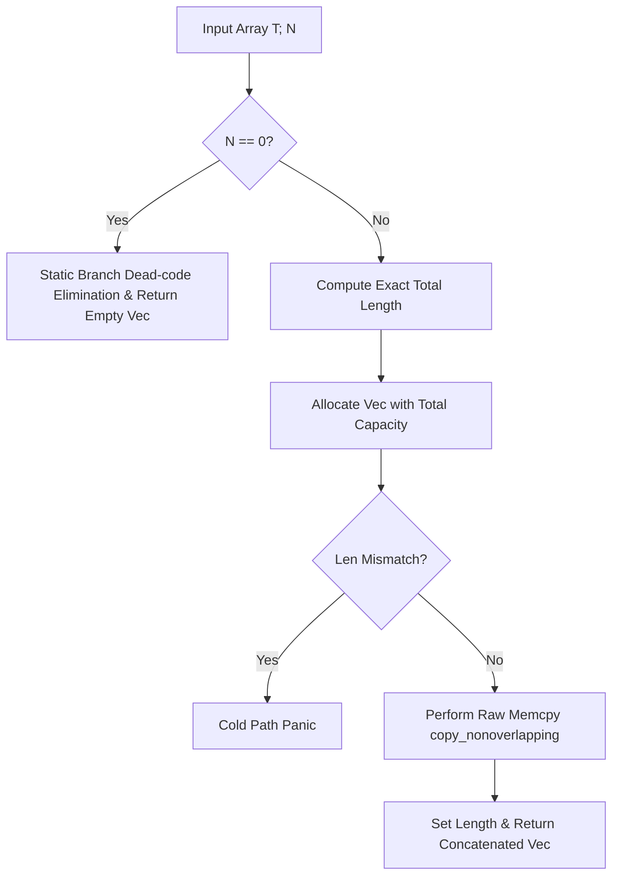
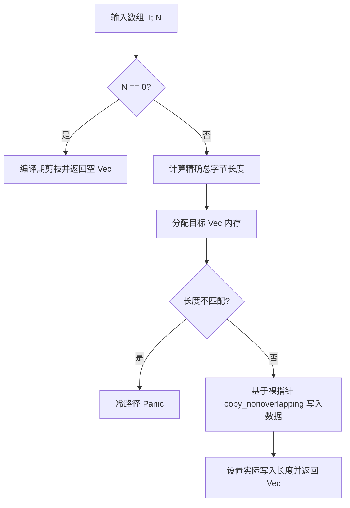

[English](#en) | [中文](#zh)

---

<a id="en"></a>

# xbin : Efficient byte array concatenation utilities

- [xbin : Efficient byte array concatenation utilities](#xbin-efficient-byte-array-concatenation-utilities)
  - [Introduction](#introduction)
  - [Usage](#usage)
  - [Features](#features)
  - [Design](#design)
  - [Technology Stack](#technology-stack)
  - [Project Structure](#project-structure)
  - [API](#api)
    - [`pub fn concat<T: AsRef<[u8]>, const N: usize>(array: [T; N]) -> Vec<u8>`](#pub-fn-concatt-asrefu8-const-n-usizearray-t-n-vecu8)
    - [`#[macro_export] macro_rules! concat`](#macro_export-macro_rules-concat)
  - [History](#history)
  - [About](#about)

Features const generics, exception safety, zero-realloc and fast memcpy.

## Introduction

xbin is performance-focused Rust library providing utility functions and macros to concatenate multiple byte arrays or objects implementing `AsRef<[u8]>` using const generics.

## Usage

```rust
use xbin::concat;

let s1 = "123";
let s2 = [4u8, 5, 6];
let s3 = vec![7u8, 8, 9];

// Concat multiple values via macro (N is inferred)
let result = concat!(s1, s2, s3);
assert_eq!(result, b"123\x04\x05\x06\x07\x08\x09");

// Concat via function
let list = [vec![1u8, 2], vec![3, 4]];
let result_func = concat(list);
assert_eq!(result_func, vec![1, 2, 3, 4]);
```

## Features

- Const Generics Optimization: Statically determines the array size `const N: usize`, eliminating runtime size checks and multi-branch fallback.
- Precise Capacity Pre-allocation: Computes total byte length before allocating vector memory, ensuring zero reallocation during insertion.
- Faster Memory Copies: Utilizes raw pointer copies to bypass bounds checks and capacity guards.
- Exception Safety: Guarantees absolute exception safety, preventing memory leaks or double frees if a panic occurs during traversal or copy.
- Defensive Length Validation: Protects against non-idempotent `as_ref()` implementations where elements return varying lengths. Employs `#[cold]` path panics to eliminate buffer overflows and uninitialized memory exposure with zero runtime cost for the normal path.

## Design

The calling flow is illustrated below:



## Technology Stack

- Rust Edition 2024
- Core library `core::ptr` & `alloc::vec::Vec` (`no_std` support)

## Project Structure

```
xbin/
├── Cargo.toml
├── README.mdt
├── src/
├── readme/
│   ├── en.md
│   └── zh.md
└── tests/
    └── main.rs
```

## API

### `pub fn concat<T: AsRef<[u8]>, const N: usize>(array: [T; N]) -> Vec<u8>`

Concatenates byte slices produced by the elements of array `[T; N]` into resulting `Vec<u8>`.

### `#[macro_export] macro_rules! concat`

Convenience macro to concatenate multiple heterogeneous types that implement `AsRef<[u8]>` (automatically builds array and passes to `concat`).

## History

In the early days of systems programming, buffer overflow vulnerabilities and slow string copy operations plagued applications due to successive allocations. The C library function `strcat` repeatedly traverses the destination string to find its end, leading to $O(N^2)$ complexity. Modern languages like Rust employ memory safety guarantees and slices. `xbin` builds on these concepts by optimizing byte concatenation down to a single memory allocation and block memory transfer using Rust's const generics, ensuring maximum CPU cache efficiency.

## About

This library is developed by [WebC.site](https://webc.site).

[WebC.site](https://webc.site): A new paradigm of web development for AI

---

<a id="zh"></a>

# xbin : 高效字节数组连接工具

- [xbin : 高效字节数组连接工具](#xbin-高效字节数组连接工具)
  - [项目功能介绍](#项目功能介绍)
  - [使用演示](#使用演示)
  - [特性介绍](#特性介绍)
  - [设计思路](#设计思路)
  - [技术堆栈](#技术堆栈)
  - [目录结构](#目录结构)
  - [API 说明](#api-说明)
    - [`pub fn concat<T: AsRef<[u8]>, const N: usize>(array: [T; N]) -> Vec<u8>`](#pub-fn-concatt-asrefu8-const-n-usizearray-t-n-vecu8)
    - [`#[macro_export] macro_rules! concat`](#macro_export-macro_rules-concat)
  - [历史故事](#历史故事)
  - [关于](#关于)

提供基于常量泛型、异常安全、零二次分配以及快速内存拷贝的字节数组拼接工具。

## 项目功能介绍

xbin 专注于提升 Rust 中拼接多个实现 `AsRef<[u8]>` 的字节数组或对象的性能。通过合并多次分配、利用编译期常量泛型静态确定数组长度，提供极高性能的函数与宏。

## 使用演示

```rust
use xbin::concat;

let s1 = "123";
let s2 = [4u8, 5, 6];
let s3 = vec![7u8, 8, 9];

// 通过宏拼接（自动推导 N）
let result = concat!(s1, s2, s3);
assert_eq!(result, b"123\x04\x05\x06\x07\x08\x09");

// 通过函数拼接
let list = [vec![1u8, 2], vec![3, 4]];
let result_func = concat(list);
assert_eq!(result_func, vec![1, 2, 3, 4]);
```

## 特性介绍

- 常量泛型优化：通过常量泛型 `const N: usize` 静态确定数组大小，完全免除运行时元素个数判断与多分支 fallback。
- 精确容量预分配：提前计算总字节数，实现最终字节向量的零二次扩容。
- 快速拷贝：基于底层裸指针拷贝，消除容量与边界安全检查。
- 异常安全：即使在迭代或拷贝期间发生 `panic`，也绝无内存泄露与双重释放 (Double Free)。
- 防御性长度校验：防御 `as_ref()` 非幂等实现（迭代时返回的长度变动），通过 `#[cold]` 标记的冷路径进行运行时溢出检测，完全杜绝缓冲区溢出与暴露未初始化内存，且对正常路径零性能损耗。

## 设计思路

整体拼接流程如下：



## 技术堆栈

- Rust 2024 版本
- 核心库指针 `core::ptr` 与 `alloc::vec::Vec` (`no_std` 支持)

## 目录结构

```
xbin/
├── Cargo.toml
├── README.mdt
├── src/
├── readme/
│   ├── en.md
│   └── zh.md
└── tests/
    └── main.rs
```

## API 说明

### `pub fn concat<T: AsRef<[u8]>, const N: usize>(array: [T; N]) -> Vec<u8>`

将已知大小数组中的所有字节切片拼接为目标 `Vec<u8>`。

### `#[macro_export] macro_rules! concat`

辅助宏，便捷拼接多个类型不同但均实现 `AsRef<[u8]>` 的表达式（自动构建数组并传入 `concat`）。

## 历史故事

在早期系统编程中，由于连续的多次内存分配，缓冲区溢出漏洞和低效的字符串拷贝层出不穷。C 语言标准的 `strcat` 函数在执行时必须重复遍历目标字符串寻找末尾，导致了 $O(N^2)$ 的复杂度灾难。现代语言如 Rust 引入了所有权和切片概念。`xbin` 结合现代 Rust 的常量泛型，将多次拼接操作在编译期即可优化的内存布局，转为一次内存分配和高效的数据块传输，榨干 CPU 缓存效率。

## 关于

本库由 [WebC.site](https://webc.site) 开发。

[WebC.site](https://webc.site) : 面向人工智能的网站开发新范式
