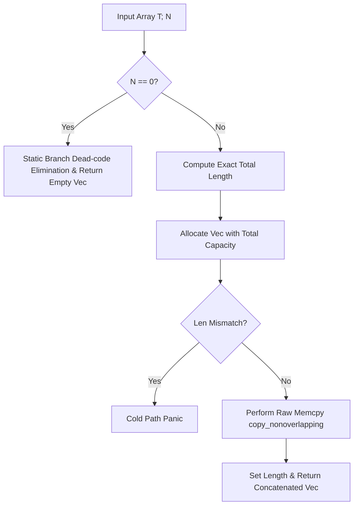

# xbin : Efficient byte array concatenation utilities

Features const generics, exception safety, zero-realloc and fast memcpy.

## Introduction

xbin is performance-focused Rust library providing utility functions and macros to concatenate multiple byte arrays or objects implementing `AsRef<[u8]>` using const generics.

## Usage

```rust
use xbin::concat;

let s1 = "123";
let s2 = [4u8, 5, 6];
let s3 = vec![7u8, 8, 9];

// Concat multiple values via macro (N is inferred)
let result = concat!(s1, s2, s3);
assert_eq!(result, b"123\x04\x05\x06\x07\x08\x09");

// Concat via function
let list = [vec![1u8, 2], vec![3, 4]];
let result_func = concat(list);
assert_eq!(result_func, vec![1, 2, 3, 4]);
```

## Features

- Const Generics Optimization: Statically determines the array size `const N: usize`, eliminating runtime size checks and multi-branch fallback.
- Precise Capacity Pre-allocation: Computes total byte length before allocating vector memory, ensuring zero reallocation during insertion.
- Faster Memory Copies: Utilizes raw pointer copies to bypass bounds checks and capacity guards.
- Exception Safety: Guarantees absolute exception safety, preventing memory leaks or double frees if a panic occurs during traversal or copy.
- Defensive Length Validation: Protects against non-idempotent `as_ref()` implementations where elements return varying lengths. Employs `#[cold]` path panics to eliminate buffer overflows and uninitialized memory exposure with zero runtime cost for the normal path.

## Design

The calling flow is illustrated below:



## Technology Stack

- Rust Edition 2024
- Core library `core::ptr` & `alloc::vec::Vec` (`no_std` support)

## Project Structure

```
xbin/
├── Cargo.toml
├── README.mdt
├── src/
├── readme/
│   ├── en.md
│   └── zh.md
└── tests/
    └── main.rs
```

## API

### `pub fn concat<T: AsRef<[u8]>, const N: usize>(array: [T; N]) -> Vec<u8>`

Concatenates byte slices produced by the elements of array `[T; N]` into resulting `Vec<u8>`.

### `#[macro_export] macro_rules! concat`

Convenience macro to concatenate multiple heterogeneous types that implement `AsRef<[u8]>` (automatically builds array and passes to `concat`).

## History

In the early days of systems programming, buffer overflow vulnerabilities and slow string copy operations plagued applications due to successive allocations. The C library function `strcat` repeatedly traverses the destination string to find its end, leading to $O(N^2)$ complexity. Modern languages like Rust employ memory safety guarantees and slices. `xbin` builds on these concepts by optimizing byte concatenation down to a single memory allocation and block memory transfer using Rust's const generics, ensuring maximum CPU cache efficiency.
