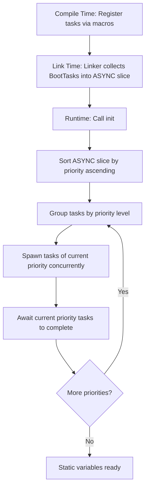

# xboot : Async Static Variable Initialization with Priority Support

## Table of Contents

- [Introduction](#introduction)
- [Features](#features)
- [Installation](#installation)
- [Usage](#usage)
- [Design](#design)
- [Tech Stack](#tech-stack)
- [Project Structure](#project-structure)
- [API Reference](#api-reference)
- [History](#history)

## Introduction

xboot executes async initialization of static variables before program execution begins.
Utilizing compile-time collection via linker sections, it groups async tasks by priority and runs them concurrently within each priority level.
This solves dependency ordering issues when initializing resources like databases and services.

## Features

- Async static variable initialization
- Priority-based dependency ordering
- Concurrent task execution within same priority
- Zero-cost compile-time collection via linker sections
- Simple macro-based API
- Full integration with tokio runtime

## Installation

Add to `Cargo.toml`:

```toml
[dependencies]
xboot = "0.1"
```

## Usage

This example demonstrates how priority resolves initialization dependencies.
`UserService` (Priority 1) depends on `Database` (Priority 0) being fully initialized.

```rust
use aok::{OK, Result};
use log::info;
use tokio::time::{Duration, sleep};

// --- Database Module (Priority 0) ---
pub struct Database {}

impl Database {
  pub fn query(&self) -> String {
    "cached_user_roles".to_string()
  }
}

pub async fn connect_db() -> Result<Database> {
  info!("DB: Connecting to database...");
  sleep(Duration::from_secs(2)).await;
  info!("DB: Connection established.");
  Ok(Database {})
}

// Register DB initialization with priority 0 (first)
xboot::init!(DB: Database {
  connect_db().await
}, 0);


// --- Service Module (Priority 1, depends on DB) ---
pub struct UserService {
  pub roles: String,
}

impl UserService {
  pub fn check_roles(&self) {
    info!("UserService: Verified roles: {}", self.roles);
  }
}

pub async fn init_user_service() -> Result<UserService> {
  info!("UserService: Initializing service...");
  // Safely query the already initialized DB static variable
  let roles = DB.query();
  info!("UserService: Loaded config from DB: {}", roles);
  Ok(UserService { roles })
}

// Register service initialization with priority 1 (runs after priority 0 tasks finish)
xboot::init!(USER_SERVICE: UserService {
  init_user_service().await
}, 1);


// --- Main Entry ---
#[tokio::main]
async fn main() -> Result<()> {
  log_init::init();
  
  info!("Main: Running xboot initialization...");
  xboot::init().await?;
  info!("Main: xboot initialization completed.");
  
  USER_SERVICE.check_roles();
  
  OK
}
```

## Design

xboot leverages linker sections via `linkme` to assemble initialization tasks.

### Execution Flow



### Key Mechanisms

1. **Linker Collection**: The `init!` and `add!` macros register initialization function pointers and metadata directly into a custom linker section.
2. **Priority Grouping**: The `init()` function runs at startup, sorting all tasks by priority. Tasks of the same priority are executed concurrently to maximize performance.
3. **Lazy Wrapping**: Static variables are wrapped in `Wrap` which dereferences to the underlying `OnceCell`. Accessing the variable before `init()` completes will block or error safely.

## Tech Stack

| Crate | Purpose |
| --- | --- |
| [linkme](https://crates.io/crates/linkme) | Compile-time linker section collection |
| [tokio](https://crates.io/crates/tokio) | Async runtime and task execution |
| [paste](https://crates.io/crates/paste) | Macro identifier concatenation |
| [gensym](https://crates.io/crates/gensym) | Unique symbol generation |
| [aok](https://crates.io/crates/aok) | Ergonomic result handling |

## Project Structure

```
xboot/
├── Cargo.toml
├── src/
│   └── lib.rs      # Core library implementation
└── tests/
    ├── Cargo.toml
    └── src/
        └── main.rs # Priority dependency demonstration
```

## API Reference

### Data Structures

- `BootTask`: Represents registered initialization metadata.
  ```rust
  pub struct BootTask {
    pub priority: i32,
    pub run: AsyncFn,
  }
  ```
- `Wrap<T>`: Safe wrapper around `OnceCell<T>`. Implements `Deref` to provide access to the initialized value.
- `OnceCell<T>`: Thread-safe, async-friendly cell for single initialization.

### Types

- `Task`: Alias for `tokio::task::JoinHandle<Result<()>>`.
- `AsyncFn`: Function pointer type `fn() -> Task`.

### Statics

- `ASYNC`: Distributed slice `[BootTask]` containing all registered tasks.

### Functions

- `init() -> Result<()>`: Collects, sorts, and executes all registered initialization tasks.
- `exit_on_err<T, E: Display>(name: &str, res: Result<T, E>) -> T`: Helper function used by the macro to log error and exit process on failure.

### Macros

- `init!(VAR: Type { init_expr })`: Registers static variable with default priority (0).
- `init!(VAR: Type { init_expr }, priority)`: Registers static variable with custom priority.
- `add!(init_expr)`: Registers async block to run at startup with default priority (0).
- `add!(init_expr, priority)`: Registers async block to run at startup with custom priority.

## History

In systems programming, global static initialization has historically been a source of subtle bugs.
In C++, this issue is notorious as the "static initialization order fiasco".
Because the order of initialization for static variables across different compilation units is undefined, variables depending on each other could be accessed before they were initialized.
This led to undefined behavior, memory corruption, and crashes.

Modern operating systems and compilers introduced constructor segments (such as ELF `.ctors` / `.init` sections on Unix-like systems and PE `.CRT$XCU` on Windows).
These segments allow compilers to register functions to execute before `main` runs.
However, this mechanism runs in a single-threaded, synchronous context, which is incompatible with modern asynchronous runtimes like Tokio.

David Tolnay created the `linkme` crate to provide a safe, cross-platform distributed slice mechanism in Rust, leveraging linker sections.
xboot builds on this foundation by introducing asynchronous task execution and strict priority scheduling.
This allows developers to define complex, interdependent async initializations (such as database connections and service discovery) that resolve deterministically before `main` starts, preventing initialization order issues while maintaining safety and performance.
