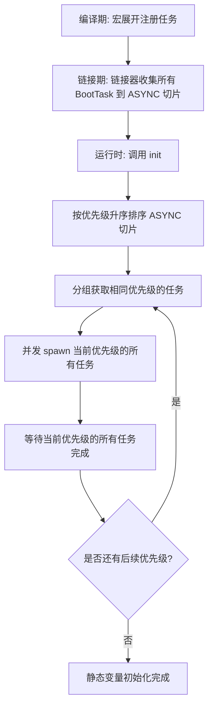

# xboot : 支持优先级的异步静态变量初始化

## 目录

- [简介](#简介)
- [特性](#特性)
- [安装](#安装)
- [使用](#使用)
- [设计](#设计)
- [技术栈](#技术栈)
- [项目结构](#项目结构)
- [API 参考](#api-参考)
- [历史](#历史)

## 简介

xboot 用于程序启动前异步初始化静态变量。
通过链接器段（Linker Sections）在编译期收集任务，运行时按优先级分组并并发执行，解决数据库、服务等模块间的初始化依赖顺序问题。

## 特性

- 异步静态变量初始化
- 基于优先级的依赖顺序控制
- 同一优先级任务并发执行
- 零运行时开销链接段收集
- 简洁的宏定义 API
- 兼容 tokio 异步运行时

## 安装

在 `Cargo.toml` 中添加：

```toml
[dependencies]
xboot = "0.1"
```

## 使用

下文演示如何通过优先级解决初始化依赖关系。
`UserService` (优先级 1) 的初始化依赖于 `Database` (优先级 0) 的完全就绪。

```rust
use aok::{OK, Result};
use log::info;
use tokio::time::{Duration, sleep};

// --- 数据库模块 (优先级 0，最先初始化) ---
pub struct Database {}

impl Database {
  pub fn query(&self) -> String {
    "cached_user_roles".to_string()
  }
}

pub async fn connect_db() -> Result<Database> {
  info!("DB: Connecting to database...");
  sleep(Duration::from_secs(2)).await;
  info!("DB: Connection established.");
  Ok(Database {})
}

// 注册数据库初始化，优先级为 0
xboot::init!(DB: Database {
  connect_db().await
}, 0);


// --- 用户服务模块 (优先级 1，依赖于数据库) ---
pub struct UserService {
  pub roles: String,
}

impl UserService {
  pub fn check_roles(&self) {
    info!("UserService: Verified roles: {}", self.roles);
  }
}

pub async fn init_user_service() -> Result<UserService> {
  info!("UserService: Initializing service...");
  // 核心依赖展示：此处直接读取并调用已初始化的全局变量 DB
  let roles = DB.query();
  info!("UserService: Loaded startup configuration from DB: {}", roles);
  Ok(UserService { roles })
}

// 注册服务初始化，优先级为 1 (确保在优先级 0 的 DB 初始化完成后再运行)
xboot::init!(USER_SERVICE: UserService {
  init_user_service().await
}, 1);


// --- 主程序入口 ---
#[tokio::main]
async fn main() -> Result<()> {
  log_init::init();
  
  info!("Main: Running xboot initialization...");
  xboot::init().await?;
  info!("Main: xboot initialization completed.");
  
  // 调用业务逻辑以验证服务已被成功初始化且成功获取了依赖数据
  USER_SERVICE.check_roles();
  
  OK
}
```

## 设计

xboot 利用 `linkme` 的分布式切片，在链接期跨 crate 依赖图收集初始化任务。

### 初始化流程



### 核心机制

1. **链接期收集**：通过 `init!` 和 `add!` 宏将异步任务指针与优先级元数据直接写入自定义链接器段。
2. **优先级分组**：在运行时启动阶段对任务按优先级排序，同一优先级的任务并发执行以最大化运行效率。
3. **安全包装**：静态变量使用 `Wrap` 包装，内部指向 `OnceCell`。初始化未完成时访问将触发安全阻塞或报错。

## 技术栈

| Crate | 用途 |
| --- | --- |
| [linkme](https://crates.io/crates/linkme) | 分布式切片，编译期收集 |
| [tokio](https://crates.io/crates/tokio) | 异步运行时与任务派发 |
| [paste](https://crates.io/crates/paste) | 宏标识符拼接 |
| [gensym](https://crates.io/crates/gensym) | 唯一符号生成 |
| [aok](https://crates.io/crates/aok) | 结果类型处理工具 |

## 项目结构

```
xboot/
├── Cargo.toml
├── src/
│   └── lib.rs      # 核心实现
└── tests/
    ├── Cargo.toml
    └── src/
        └── main.rs # 依赖依赖性演练示例
```

## API 参考

### 数据结构

- `BootTask`：引导初始化任务结构体，包含优先级与初始化函数。
  ```rust
  pub struct BootTask {
    pub priority: i32,
    pub run: AsyncFn,
  }
  ```
- `Wrap<T>`：安全包装器，包装 `OnceCell<T>`，实现 `Deref` 以提供对初始化后值的访问。
- `OnceCell<T>`：线程安全、支持异步的单次初始化单元。

### 类型

- `Task`：`tokio::task::JoinHandle<Result<()>>` 类型别名。
- `AsyncFn`：`fn() -> Task` 函数指针。

### 静态变量

- `ASYNC`：存储所有已注册 `BootTask` 的分布式切片。

### 函数

- `init() -> Result<()>`：排序并并发执行所有注册的初始化任务。
- `exit_on_err<T, E: Display>(name: &str, res: Result<T, E>) -> T`：辅助函数，用于初始化失败时记录错误日志并退出进程。

### 宏

- `init!(VAR: Type { init_expr })`：以默认优先级 (0) 注册静态变量。
- `init!(VAR: Type { init_expr }, priority)`：以自定义优先级注册静态变量。
- `add!(init_expr)`: 注册默认优先级 (0) 的异步初始化表达式。
- `add!(init_expr, priority)`: 注册自定义优先级的异步初始化表达式。

## 历史

在系统编程中，全局静态变量的初始化顺序极易引发隐蔽缺陷。
C++ 中这一经典缺陷被称为“静态初始化顺序灾难”（Static Initialization Order Fiasco）。
由于编译器无法跨编译单元确定静态变量的初始化顺序，相互依赖的全局变量可能在未就绪时被读取，导致未定义行为或程序崩溃。

为了解决此问题，现代操作系统和编译器引入了构造函数段（如 Unix 的 `.init`/`.ctors` 和 Windows 的 `.CRT$XCU`），允许在 `main` 执行前运行注册函数。
然而，该底层的同步执行方式无法与现代异步运行时（如 Tokio）协作。

Rust 开发者 David Tolnay 编写的 `linkme` 利用链接段实现跨平台分布式切片，提供了安全高效的链接期收集方案。
xboot 在此基础上结合异步协程与优先级调度，使现代 Rust 应用程序能够按拓扑顺序确定性地在 `main` 启动前初始化数据库、服务等复杂异步资源，在保障安全性的同时维持极致运行效率。
