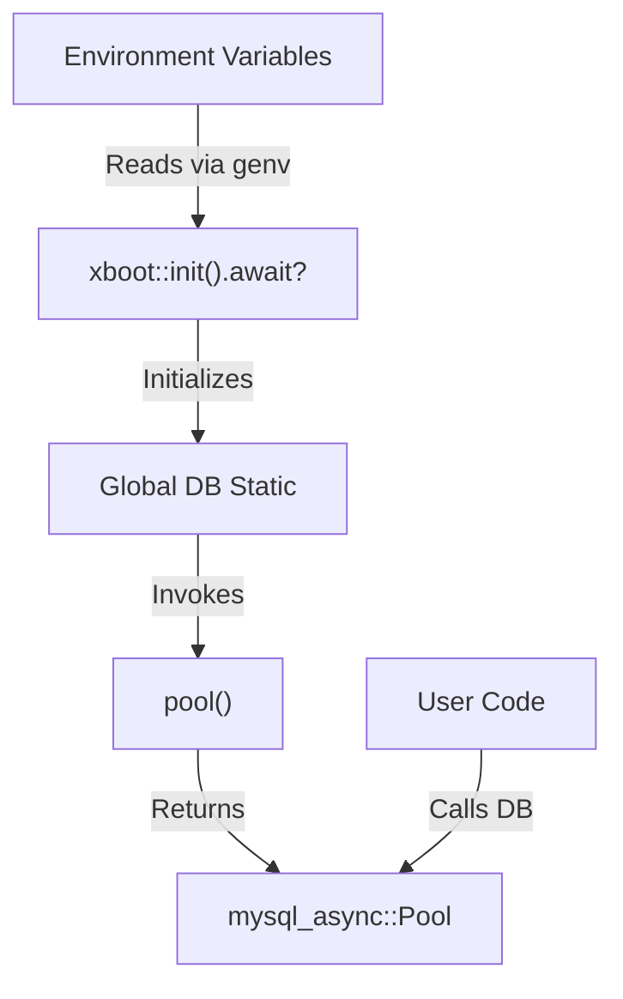
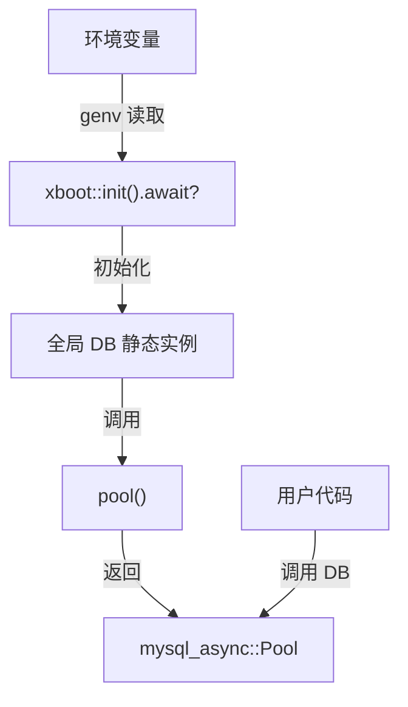

[English](#en) | [中文](#zh)

---

<a id="en"></a>
# xdb : Fast and environment-driven MySQL connection pool initialization

- [xdb : Fast and environment-driven MySQL connection pool initialization](#xdb-fast-and-environment-driven-mysql-connection-pool-initialization)
  - [Table of Contents](#table-of-contents)
  - [Introduction](#introduction)
  - [Usage](#usage)
    - [Manual Pool Creation](#manual-pool-creation)
    - [Environment-Driven Global Pool (xboot)](#environment-driven-global-pool-xboot)
  - [Features](#features)
  - [Design](#design)
  - [Tech Stack](#tech-stack)
  - [Directory Structure](#directory-structure)
  - [API](#api)
    - [Functions](#functions)
      - [`pool`](#pool)
    - [Statics](#statics)
      - [`DB`](#db)
  - [History](#history)
  - [About](#about)

## Table of Contents

- [Introduction](#introduction)
- [Usage](#usage)
- [Features](#features)
- [Design](#design)
- [Tech Stack](#tech-stack)
- [Directory Structure](#directory-structure)
- [API](#api)
- [History](#history)

## Introduction

xdb simplifies asynchronous MySQL connection pool initialization in Rust. It wraps mysql_async and integrates with xboot for automatic configuration via environment variables, offering instant access to global database connection pools.

## Usage

Add dependencies to Cargo.toml:

```toml
[dependencies]
xdb = "0.1"
```

### Manual Pool Creation

Create connection pool programmatically:

```rust
use xdb::pool;

#[tokio::main]
async fn main() -> Result<(), Box<dyn std::error::Error>> {
  let db_pool = pool(
    "127.0.0.1",
    3306,
    Some("root"),
    Some("password"),
    Some("test_db"),
  );

  let mut conn = db_pool.get_conn().await?;
  // Use connection
  Ok(())
}
```

### Environment-Driven Global Pool (xboot)

By enabling default xboot feature, xdb automatically loads configurations from environment variables and exposes static global pool `DB`:

Set environment variables:

```bash
export DB_HOST=127.0.0.1
export DB_PORT=3306
export DB_USER=root
export DB_PASSWORD=password
export DB_NAME=test_db
```

Access global pool directly:

> [!IMPORTANT]
> You must call `xboot::init().await?;` at the beginning of the `main` function to trigger asynchronous initialization of the global database pool.

```rust
use xdb::DB;

#[tokio::main]
async fn main() -> Result<(), Box<dyn std::error::Error>> {
  xboot::init().await?;

  let mut conn = DB.get_conn().await?;
  // Use connection
  Ok(())
}
```

## Features

- Environment-driven static connection pool initialization.
- Automatic SSL configuration with invalid certificates acceptance.
- Native integration with mysql_async.
- Thread-safe global sharing.

## Design

Calls flow is illustrated below:



## Tech Stack

- **mysql_async**: Asynchronous MySQL driver.
- **xboot**: Framework for auto-running initialization tasks.
- **genv**: Environment variables loader.
- **rustls**: Modern TLS library.

## Directory Structure

```
.
├── Cargo.toml
├── src
│   ├── lib.rs     # Library entry point, exports pool() and DB
│   └── xboot.rs   # Static global pool declaration via xboot
└── tests
    └── main.rs    # Integration tests
```

## API

### Functions

#### `pool`

```rust
pub fn pool(
  host: &str,
  port: u16,
  user: Option<&str>,
  pass: Option<&str>,
  db_name: Option<&str>,
) -> mysql_async::Pool
```

Creates connection pool with standard configuration and custom SSL options.

### Statics

#### `DB`

```rust
pub static DB: mysql_async::Pool;
```

Global database connection pool initialized on first access using configuration parameters from environment variables:
- `DB_HOST` (Required)
- `DB_PORT` (Default: 3306)
- `DB_USER` (Optional)
- `DB_PASSWORD` (Optional)
- `DB_NAME` (Optional)

Available only when `xboot` feature is enabled.

## History

In the early days of database engineering, establishing database connections was slow. Software systems performed TCP handshakes, TLS handshakes, and database authentication for each request. This led to massive latency. The concept of connection pools emerged to solve this issue by reusing established connections, significantly improving application performance. xdb inherits this legacy and optimizes it for modern Rust ecosystem, providing zero-boilerplate connection pooling mechanism.

## About

This library is developed by [WebC.site](https://webc.site).

[WebC.site](https://webc.site): A new paradigm of web development for AI


---

<a id="zh"></a>
# xdb : 快速且环境驱动的 MySQL 连接池初始化

- [xdb : 快速且环境驱动的 MySQL 连接池初始化](#xdb-快速且环境驱动的-mysql-连接池初始化)
  - [目录](#目录)
  - [项目功能介绍](#项目功能介绍)
  - [使用演示](#使用演示)
    - [手动创建连接池](#手动创建连接池)
    - [环境驱动全局连接池 (xboot)](#环境驱动全局连接池-xboot)
  - [特性介绍](#特性介绍)
  - [设计思路](#设计思路)
  - [技术堆栈](#技术堆栈)
  - [目录结构](#目录结构)
  - [API 说明](#api-说明)
    - [函数](#函数)
      - [`pool`](#pool)
    - [静态变量](#静态变量)
      - [`DB`](#db)
  - [历史故事](#历史故事)
  - [关于](#关于)

## 目录

- [项目功能介绍](#项目功能介绍)
- [使用演示](#使用演示)
- [特性介绍](#特性介绍)
- [设计思路](#设计思路)
- [技术堆栈](#技术堆栈)
- [目录结构](#目录结构)
- [API 说明](#api-说明)
- [历史故事](#历史故事)

## 项目功能介绍

xdb 简化 Rust 中异步 MySQL 连接池初始化过程。结合 mysql_async 与 xboot，支持通过环境变量自动配置，提供全局数据库连接池。

## 使用演示

将依赖添加到 Cargo.toml：

```toml
[dependencies]
xdb = "0.1"
```

### 手动创建连接池

通过代码直接创建连接池：

```rust
use xdb::pool;

#[tokio::main]
async fn main() -> Result<(), Box<dyn std::error::Error>> {
  let db_pool = pool(
    "127.0.0.1",
    3306,
    Some("root"),
    Some("password"),
    Some("test_db"),
  );

  let mut conn = db_pool.get_conn().await?;
  // 使用连接
  Ok(())
}
```

### 环境驱动全局连接池 (xboot)

启用默认 xboot 特性，xdb 自动从环境变量加载配置并暴露静态全局连接池 `DB`：

设置环境变量：

```bash
export DB_HOST=127.0.0.1
export DB_PORT=3306
export DB_USER=root
export DB_PASSWORD=password
export DB_NAME=test_db
```

直接访问全局连接池：

> [!IMPORTANT]
> 必须在 `main` 函数最开始调用 `xboot::init().await?;` 以触发全局数据库连接池初始化。

```rust
use xdb::DB;

#[tokio::main]
async fn main() -> Result<(), Box<dyn std::error::Error>> {
  xboot::init().await?;

  let mut conn = DB.get_conn().await?;
  // 使用连接
  Ok(())
}
```

## 特性介绍

- 环境驱动静态连接池初始化。
- 自动 SSL 配置，默认接受无效证书（便于云服务接入）。
- 原生集成 mysql_async。
- 线程安全全局共享。

## 设计思路

调用流程如下所示：



## 技术堆栈

- **mysql_async**: 异步 MySQL 驱动。
- **xboot**: 初始化任务自动运行框架。
- **genv**: 环境变量加载器。
- **rustls**: 现代 TLS 实现。

## 目录结构

```
.
├── Cargo.toml
├── src
│   ├── lib.rs     # 库入口，导出 pool() 与 DB
│   └── xboot.rs   # 静态全局 DB 声明
└── tests
    └── main.rs    # 集成测试
```

## API 说明

### 函数

#### `pool`

```rust
pub fn pool(
  host: &str,
  port: u16,
  user: Option<&str>,
  pass: Option<&str>,
  db_name: Option<&str>,
) -> mysql_async::Pool
```

创建数据库连接池。使用默认 SSL 配置，开启危险证书信任选项。

### 静态变量

#### `DB`

```rust
pub static DB: mysql_async::Pool;
```

全局数据库连接池。首次访问时自动初始化，通过以下环境变量读取配置：
- `DB_HOST` (必填)
- `DB_PORT` (默认值: 3306)
- `DB_USER` (选填)
- `DB_PASSWORD` (选填)
- `DB_NAME` (选填)

仅在开启 `xboot` 特性时可用。

## 历史故事

在数据库工程早期阶段，建立连接操作高昂。系统需为每次请求执行 TCP 握手、TLS 握手及数据库身份验证。这带来了巨大的延迟。随后连接池概念诞生，通过复用已有连接，大幅提升应用性能。xdb 继承此设计，针对现代 Rust 生态进行优化，提供无样板代码的连接池机制。

## 关于

本库由 [WebC.site](https://webc.site) 开发。

[WebC.site](https://webc.site) : 面向人工智能的网站开发新范式

