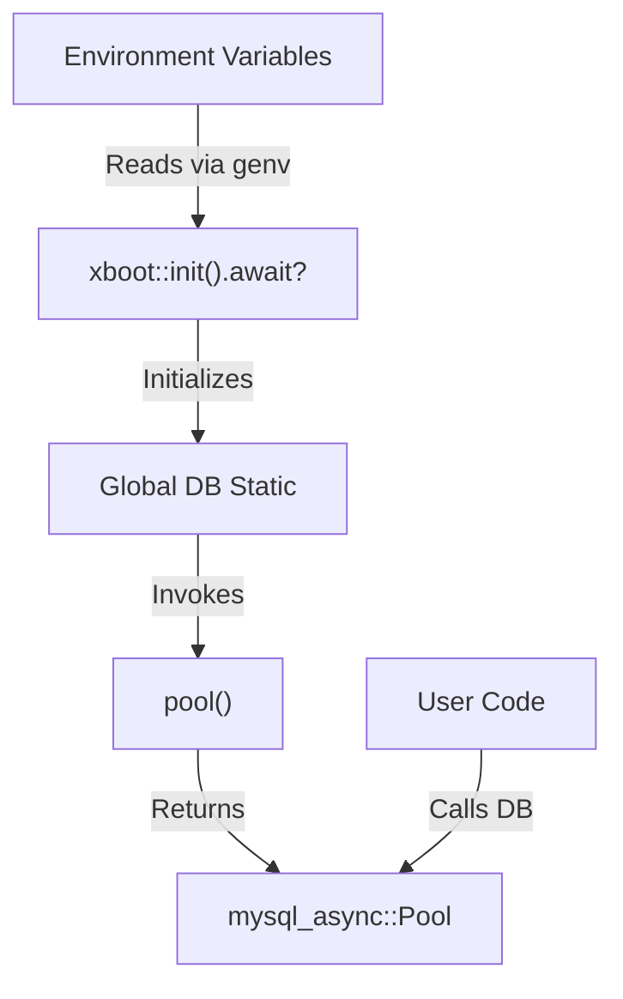

# xdb : Fast and environment-driven MySQL connection pool initialization

## Table of Contents

- [Introduction](#introduction)
- [Usage](#usage)
- [Features](#features)
- [Design](#design)
- [Tech Stack](#tech-stack)
- [Directory Structure](#directory-structure)
- [API](#api)
- [History](#history)

## Introduction

xdb simplifies asynchronous MySQL connection pool initialization in Rust. It wraps mysql_async and integrates with xboot for automatic configuration via environment variables, offering instant access to global database connection pools.

## Usage

Add dependencies to Cargo.toml:

```toml
[dependencies]
xdb = "0.1"
```

### Manual Pool Creation

Create connection pool programmatically:

```rust
use xdb::pool;

#[tokio::main]
async fn main() -> Result<(), Box<dyn std::error::Error>> {
  let db_pool = pool(
    "127.0.0.1",
    3306,
    Some("root"),
    Some("password"),
    Some("test_db"),
  );

  let mut conn = db_pool.get_conn().await?;
  // Use connection
  Ok(())
}
```

### Environment-Driven Global Pool (xboot)

By enabling default xboot feature, xdb automatically loads configurations from environment variables and exposes static global pool `DB`:

Set environment variables:

```bash
export DB_HOST=127.0.0.1
export DB_PORT=3306
export DB_USER=root
export DB_PASSWORD=password
export DB_NAME=test_db
```

Access global pool directly:

> [!IMPORTANT]
> You must call `xboot::init().await?;` at the beginning of the `main` function to trigger asynchronous initialization of the global database pool.

```rust
use xdb::DB;

#[tokio::main]
async fn main() -> Result<(), Box<dyn std::error::Error>> {
  xboot::init().await?;

  let mut conn = DB.get_conn().await?;
  // Use connection
  Ok(())
}
```

## Features

- Environment-driven static connection pool initialization.
- Automatic SSL configuration with invalid certificates acceptance.
- Native integration with mysql_async.
- Thread-safe global sharing.

## Design

Calls flow is illustrated below:



## Tech Stack

- **mysql_async**: Asynchronous MySQL driver.
- **xboot**: Framework for auto-running initialization tasks.
- **genv**: Environment variables loader.
- **rustls**: Modern TLS library.

## Directory Structure

```
.
├── Cargo.toml
├── src
│   ├── lib.rs     # Library entry point, exports pool() and DB
│   └── xboot.rs   # Static global pool declaration via xboot
└── tests
    └── main.rs    # Integration tests
```

## API

### Functions

#### `pool`

```rust
pub fn pool(
  host: &str,
  port: u16,
  user: Option<&str>,
  pass: Option<&str>,
  db_name: Option<&str>,
) -> mysql_async::Pool
```

Creates connection pool with standard configuration and custom SSL options.

### Statics

#### `DB`

```rust
pub static DB: mysql_async::Pool;
```

Global database connection pool initialized on first access using configuration parameters from environment variables:

- `DB_HOST` (Required)
- `DB_PORT` (Default: 3306)
- `DB_USER` (Optional)
- `DB_PASSWORD` (Optional)
- `DB_NAME` (Optional)

Available only when `xboot` feature is enabled.

## History

In the early days of database engineering, establishing database connections was slow. Software systems performed TCP handshakes, TLS handshakes, and database authentication for each request. This led to massive latency. The concept of connection pools emerged to solve this issue by reusing established connections, significantly improving application performance. xdb inherits this legacy and optimizes it for modern Rust ecosystem, providing zero-boilerplate connection pooling mechanism.
