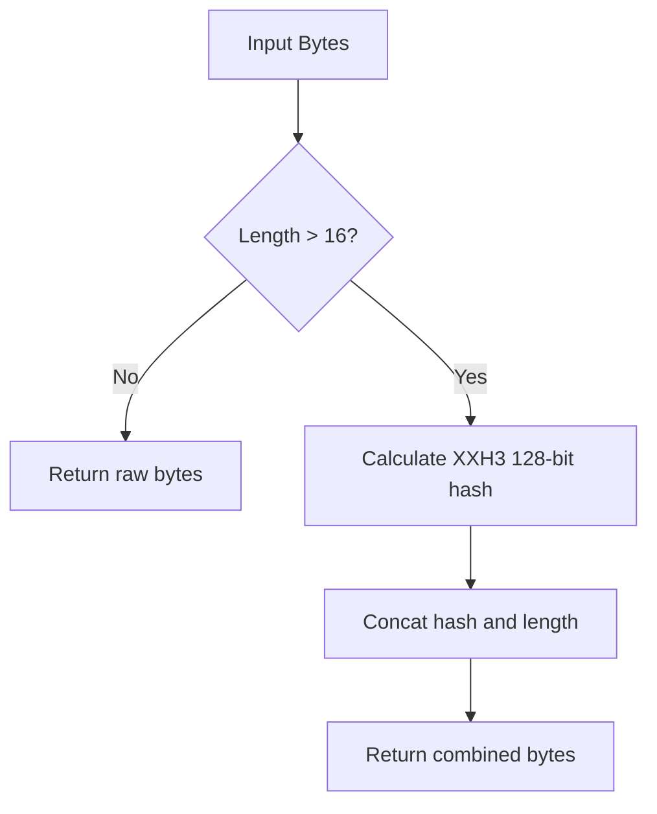

# xhash : Fast and simple xxHash wrapper for Rust

## Introduction

Provides wrapper for xxHash algorithm via `xxhash-rust` crate. Optimized for small key spaces and streaming throughput.

## Usage

```rust
use xhash::{Hasher, fs::hash_len, hash128, xhash};

fn main() -> Result<(), Box<dyn std::error::Error>> {
  let data = b"data to hash";

  // Basic hash (identity for <= 16 bytes, else hash+len)
  let hash = xhash(data);

  // Raw 128-bit hash
  let h128 = hash128(data);

  // Streaming hash
  let mut hasher = Hasher::new();
  hasher.write(data);
  let hash_stream = hasher.finish();

  Ok(())
}
```

## Features

- Short-key optimization: returns raw input bytes directly if input length <= 16 bytes.
- Stream hashing optimization: buffers data and feeds XXH3 in 16 KiB blocks to maximize SIMD pipeline utilization.
- Secure seed: compile-time generated secret key based on custom seed.
- Combined output: appends length encoding to hash bytes to prevent collisions.

## Design

Hashed output logic:



When processing streams using [Hasher](file:///Users/z/git/npm/xhash/src/hasher.rs#L7-L11), writes are buffered. The underlying XXH3 engine is updated only in multiples of 16 KiB blocks, preserving optimal CPU cache alignment and instruction throughput.

## Technology Stack

- Rust (Edition 2024)
- `xxhash-rust` (core hashing engine)
- `intbin` (efficient binary integer encoding)

## Directory Structure

- [src](file:///Users/z/git/npm/xhash/src)
  - [lib.rs](file:///Users/z/git/npm/xhash/src/lib.rs): Library entry point, core hashing methods and constants.
  - [fs.rs](file:///Users/z/git/npm/xhash/src/fs.rs): File system hashing utility.
  - [hasher.rs](file:///Users/z/git/npm/xhash/src/hasher.rs): Stream-based hasher with SIMD optimizations.
  - [hash_li.rs](file:///Users/z/git/npm/xhash/src/hash_li.rs): Utility for hashing list collections.
- [tests](file:///Users/z/git/npm/xhash/tests)
  - [main.rs](file:///Users/z/git/npm/xhash/tests/main.rs): Integration test suite.

## API Documentation

### Constants

- [SEED](file:///Users/z/git/npm/xhash/src/lib.rs#L8): Base hash seed.
- [SECRET](file:///Users/z/git/npm/xhash/src/lib.rs#L9): 192-byte key derived from seed during compilation.
- [HASH128_LEN](file:///Users/z/git/npm/xhash/src/lib.rs#L10): Split threshold size (16 bytes).

### Functions

- [hasher](file:///Users/z/git/npm/xhash/src/lib.rs#L12-L14): Instantiates new XXH3 builder with custom secret.
- [hash64](file:///Users/z/git/npm/xhash/src/lib.rs#L25-L27): Calculates 64-bit XXH3 hash using custom secret.
- [hash128](file:///Users/z/git/npm/xhash/src/lib.rs#L29-L31): Calculates 128-bit XXH3 hash using custom secret.
- [hash_len_concat](file:///Users/z/git/npm/xhash/src/lib.rs#L33-L40): Concatenates 128-bit hash and binary-encoded length.
- [xhash](file:///Users/z/git/npm/xhash/src/lib.rs#L43-L50): Returns identity slice if size <= 16, else returns concatenated hash-length.
- [hash_len](file:///Users/z/git/npm/xhash/src/fs.rs#L26-L60): Efficiently hashes file path content.

### Structs

- [Hasher](file:///Users/z/git/npm/xhash/src/hasher.rs#L7-L11): Buffered stream hasher with SIMD optimization.
- [HashLen](file:///Users/z/git/npm/xhash/src/fs.rs#L10-L13): Container holding final hash bytes and file length.
- [HashLi](file:///Users/z/git/npm/xhash/src/hash_li.rs#L5-L6): Vector wrapping list of hashed inputs.

## History & Background

xxHash was created by Yann Collet around 2012. He designed it as fast checksum engine for his LZ4 compression algorithm. Existing cryptographic hash algorithms introduced high CPU overheads, while standard non-cryptographic hashes failed to saturate RAM bandwidth. Collet set out to create hashing algorithm that could operate at RAM speed limits. The "xx" prefix represents "extremely", denoting processing speeds faster than memory copies.
