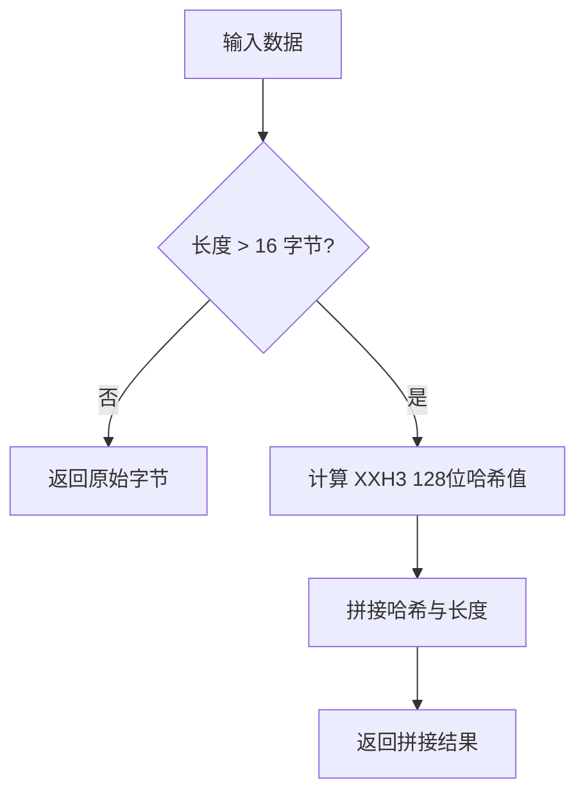

# xhash : 快速、简洁的 Rust xxHash 封装

## 项目功能介绍

封装 `xxhash-rust` 提供 xxHash 算法支持。针对短键空间进行存储优化，并提升流式哈希吞吐性能。

## 使用演示

```rust
use xhash::{Hasher, fs::hash_len, hash128, xhash};

fn main() -> Result<(), Box<dyn std::error::Error>> {
  let data = b"data to hash";

  // 基础哈希 (数据长度 <= 16 字节直接返回原内容，否则返回哈希值与长度拼接结果)
  let hash = xhash(data);

  // 原始 128 位哈希
  let h128 = hash128(data);

  // 流式哈希
  let mut hasher = Hasher::new();
  hasher.write(data);
  let hash_stream = hasher.finish();

  Ok(())
}
```

## 特性介绍

- 短键优化：输入数据长度 <= 16 字节时，直接返回原始字节，免去哈希计算开销。
- 流式优化：内部数据缓存达到 16 KiB 时批量更新 XXH3，最大化 SIMD 流水线利用率。
- 安全种子：编译期基于自定义种子自动生成 192 字节密钥。
- 碰撞防范：哈希结果尾部拼接长度二进制编码，防止不同长度数据哈希混淆。

## 设计思路

哈希逻辑流程：



使用 [Hasher](file:///Users/z/git/npm/xhash/src/hasher.rs#L7-L11) 处理流式输入时，写入数据首先存入内部缓冲区。仅当缓冲区数据达到 16 KiB 整数倍时，才更新底层 XXH3 引擎，以确保 CPU 缓存对齐并提升指令吞吐。

## 技术堆栈

- Rust (Edition 2024)
- `xxhash-rust`（核心哈希引擎）
- `intbin`（高效二进制整数编码）

## 目录结构

- [src](file:///Users/z/git/npm/xhash/src)
  - [lib.rs](file:///Users/z/git/npm/xhash/src/lib.rs)：项目入口，定义核心哈希方法与常量。
  - [fs.rs](file:///Users/z/git/npm/xhash/src/fs.rs)：文件系统哈希函数。
  - [hasher.rs](file:///Users/z/git/npm/xhash/src/hasher.rs)：流式哈希实现，针对 SIMD 优化。
  - [hash_li.rs](file:///Users/z/git/npm/xhash/src/hash_li.rs)：哈希列表集合助手。
- [tests](file:///Users/z/git/npm/xhash/tests)
  - [main.rs](file:///Users/z/git/npm/xhash/tests/main.rs)：集成测试。

## API 说明

### 常量

- [SEED](file:///Users/z/git/npm/xhash/src/lib.rs#L8)：基础哈希种子。
- [SECRET](file:///Users/z/git/npm/xhash/src/lib.rs#L9)：编译期由种子导出的 192 字节密钥。
- [HASH128_LEN](file:///Users/z/git/npm/xhash/src/lib.rs#L10)：短键阈值（16 字节）。

### 函数

- [hasher](file:///Users/z/git/npm/xhash/src/lib.rs#L12-L14)：创建带自定义密钥的 XXH3 构造器。
- [hash64](file:///Users/z/git/npm/xhash/src/lib.rs#L25-L27)：使用自定义密钥计算 64 位 XXH3 哈希值。
- [hash128](file:///Users/z/git/npm/xhash/src/lib.rs#L29-L31)：使用自定义密钥计算 128 位 XXH3 哈希值。
- [hash_len_concat](file:///Users/z/git/npm/xhash/src/lib.rs#L33-L40)：拼接 128 位哈希值与长度二进制编码。
- [xhash](file:///Users/z/git/npm/xhash/src/lib.rs#L43-L50)：若长度 <= 16 字节返回原数据，否则返回哈希值与长度拼接结果。
- [hash_len](file:///Users/z/git/npm/xhash/src/fs.rs#L26-L60)：高效计算指定路径文件哈希值与长度。

### 结构体

- [Hasher](file:///Users/z/git/npm/xhash/src/hasher.rs#L7-L11)：支持 SIMD 优化的流式哈希器。
- [HashLen](file:///Users/z/git/npm/xhash/src/fs.rs#L10-L13)：存储最终哈希字节与文件长度的容器。
- [HashLi](file:///Users/z/git/npm/xhash/src/hash_li.rs#L5-L6)：对元素执行 xhash 后的向量封装。

## 历史与背景

xxHash 由 Yann Collet 于 2012 年发布。当时 Collet 正在为自行开发的 LZ4 压缩算法寻找匹配的数据校验引擎。由于传统加密哈希算法 CPU 开销过大，而非加密哈希算法难以跑满内存带宽，Collet 决定设计以内存极限读取速度为目标的非加密哈希算法。算法前缀 “xx” 代表 “extremely”（极度），意指速度超越普通内存复制。
