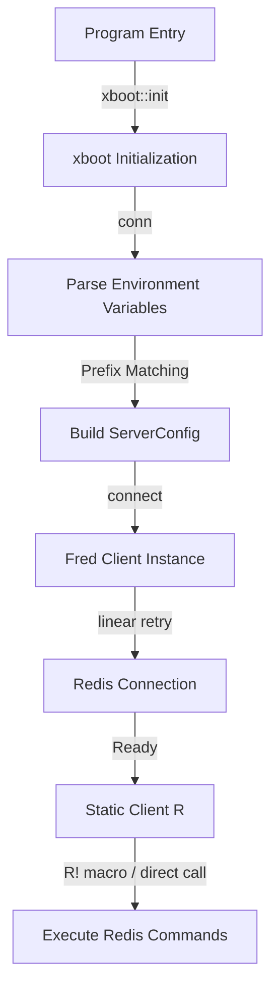
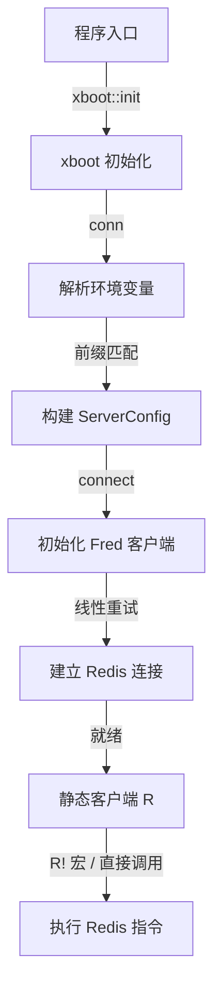

[English](#en) | [中文](#zh)

---

<a id="en"></a>

# xkv : Static Global Redis Client Manager for Fred and Kvrocks

- [xkv : Static Global Redis Client Manager for Fred and Kvrocks](#xkv-static-global-redis-client-manager-for-fred-and-kvrocks)
  - [Introduction](#introduction)
  - [Usage](#usage)
  - [Features](#features)
  - [Design](#design)
  - [Tech Stack](#tech-stack)
  - [Directory Structure](#directory-structure)
  - [API Description](#api-description)
    - [Structs](#structs)
      - [`Server`](#server)
    - [Functions](#functions)
    - [Macros](#macros)
  - [History](#history)
  - [About](#about)

- [Introduction](#introduction)
- [Usage](#usage)
- [Features](#features)
- [Design](#design)
- [Tech Stack](#tech-stack)
- [Directory Structure](#directory-structure)
- [API Description](#api-description)
- [History](#history)

## Introduction

xkv provides static global Redis client management. Built on top of Fred client, xkv enables connections to Redis or Kvrocks via environment variables.

## Usage

Refer to `tests/src/main.rs` for initialization and operations:

```rust
use aok::{OK, Result};
use xkv::xboot;
use xkv::{R, fred::interfaces::KeysInterface, log::info};

async fn test_redis() -> Result<()> {
  let key = "xkvtest1";
  let val = "abc";
  R!(del key);

  let v: bool = R.exists(key).await?;
  assert!(!v);

  let v: Option<String> = R.get(key).await?;
  info!("get {key} = {:?}", v);
  assert_eq!(v, None);

  R!(set key, val, None, None, false);

  let v: Option<String> = R.get(key).await?;
  info!("get {key} = {:?}", v);
  assert_eq!(v, Some(val.into()));

  R!(del key);

  OK
}

#[tokio::main]
async fn main() -> Result<()> {
  // Call it only once in the main function of the program
  xboot::init().await?;
  test_redis().await?;
  OK
}
```

Environment variables prefix configures connections:

```bash
R_NODE=127.0.0.1:6379
R_PASSWORD=your_password
```

## Features

- **Global Static Instance**: Connects static clients through macros, removing client-passing boilerplate.
- **Fred Integration**: Supports performance optimizations from Fred driver.
- **Multiple Topologies**: Configures centralized, clustered, sentinel, and Unix socket deployments.
- **Automatic Reconnection**: Implements linear backoff retry strategies.
- **Performance & Safety Optimizations**:
  - **Hot-loop Prevention**: Adds a 1-second non-blocking sleep delay during connection retries, preventing CPU-hogging hot loops when Redis is down.
  - **Zero-allocation env lookup**: Reuses an internal `String` buffer for environment variable assembly, avoiding memory allocation overhead from `format!`.
  - **Production-ready Validation**: Validates config inputs like `DB` and `SENTINEL_PORT` to prevent unexpected panics from bad configuration.

## Design

Initialization and query execution follow this logic:



## Tech Stack

- **Rust**: Language platform.
- **Fred**: Fast Redis client driver.
- **xboot**: Startup initialization framework.
- **aok**: Result error handler.

## Directory Structure

```text
.
├── Cargo.toml
├── README.md
├── README.mdt
├── src/
│   ├── lib.rs
│   ├── macro.rs
│   └── r.rs
└── tests/
    ├── Cargo.toml
    └── src/
        └── main.rs
```

## API Description

### Structs

#### `Server`

Defines static helpers returning `ServerConfig`.

- `pub fn unix_sock(path: impl Into<PathBuf>) -> ServerConfig`
  Creates Unix socket server configuration.
- `pub fn cluster(hosts: Vec<FredServer>) -> ServerConfig`
  Creates clustered deployment configuration.
- `pub fn sentinel(service_name: impl Into<String>, hosts: Vec<FredServer>, username: Option<String>, password: Option<String>) -> ServerConfig`
  Creates sentinel deployment configuration.
- `pub fn centralized(server: FredServer) -> ServerConfig`
  Creates centralized server configuration.

### Functions

- `pub fn server_li(host_port: impl AsRef<str>, default_port: u16) -> Vec<FredServer>`
  Parses space-separated lists of host-port addresses.
- `pub async fn conn(prefix: impl AsRef<str>) -> Result<Client>`
  Builds connection using environment variables matching prefix.
- `pub async fn connect(server: &ServerConfig, username: Option<String>, password: Option<String>, database: Option<u8>, resp: Option<&str>) -> Result<Client>`
  Initializes and connects client instances.

### Macros

- `conn!`
  Defines global static client.
- `conn_with_dollar!`
  Helper macro providing macro generation logic.

## History

In 2007, Salvatore Sanfilippo (known as antirez) faced performance bottlenecks while developing LLOOGG, real-time web analytics software. MySQL struggled with high-frequency writes and real-time retrieval of recent page views. To overcome limitations, Sanfilippo developed in-memory database designed around specific data structures like lists and sets. Released in 2009 under name Redis (Remote Dictionary Server), technology successfully powered LLOOGG and evolved into foundational modern caching infrastructure.

## About

This library is developed by [WebC.site](https://webc.site).

[WebC.site](https://webc.site): A new paradigm of web development for AI

---

<a id="zh"></a>

# xkv : 基于 Fred 与 Kvrocks 的全局静态 Redis 客户端管理器

- [xkv : 基于 Fred 与 Kvrocks 的全局静态 Redis 客户端管理器](#xkv-基于-fred-与-kvrocks-的全局静态-redis-客户端管理器)
  - [项目功能介绍](#项目功能介绍)
  - [使用演示](#使用演示)
  - [特性介绍](#特性介绍)
  - [设计思路](#设计思路)
  - [技术堆栈](#技术堆栈)
  - [目录结构](#目录结构)
  - [API 说明](#api-说明)
    - [结构体](#结构体)
      - [`Server`](#server)
    - [函数](#函数)
    - [宏](#宏)
  - [历史故事](#历史故事)
  - [关于](#关于)

- [项目功能介绍](#项目功能介绍)
- [使用演示](#使用演示)
- [特性介绍](#特性介绍)
- [设计思路](#设计思路)
- [技术堆栈](#技术堆栈)
- [目录结构](#目录结构)
- [API 说明](#api-说明)
- [历史故事](#历史故事)

## 项目功能介绍

xkv 实现全局静态 Redis 客户端管理。基于 Fred 客户端构建，支持通过环境变量配置并连接 Redis 或 Kvrocks。

## 使用演示

参考 `tests/src/main.rs` 编写初始化及操作代码：

```rust
use aok::{OK, Result};
use xkv::xboot;
use xkv::{R, fred::interfaces::KeysInterface, log::info};

async fn test_redis() -> Result<()> {
  let key = "xkvtest1";
  let val = "abc";
  R!(del key);

  let v: bool = R.exists(key).await?;
  assert!(!v);

  let v: Option<String> = R.get(key).await?;
  info!("get {key} = {:?}", v);
  assert_eq!(v, None);

  R!(set key, val, None, None, false);

  let v: Option<String> = R.get(key).await?;
  info!("get {key} = {:?}", v);
  assert_eq!(v, Some(val.into()));

  R!(del key);

  OK
}

#[tokio::main]
async fn main() -> Result<()> {
  // 仅在程序启动的main函数中调用一次
  xboot::init().await?;
  test_redis().await?;
  OK
}
```

连接配置基于环境变量前缀：

```bash
R_NODE=127.0.0.1:6379
R_PASSWORD=your_password
```

## 特性介绍

- **全局静态实例**：使用宏定义静态客户端，消除传递客户端实例的冗余代码。
- **Fred 驱动整合**：继承 Fred 驱动的高性能与重连机制。
- **多拓扑支持**：支持单机、集群、哨兵以及 Unix 域套接字连接。
- **自动重连**：配置线性退避重试策略，保证连接稳定性。
- **性能与安全优化**：
  - **规避重试空转**：宏连接重试包含 1 秒的非阻塞睡眠，避免 Redis 故障时进行高 CPU 空转热循环。
  - **缓冲区复用**：环境配置解析通过复用内部 `String` 缓冲，避免多次 `format!` 带来的堆内存分配。
  - **生产防 Panic**：对环境变量（如 `DB` 和 `SENTINEL_PORT`）进行严格校验，避免因非法数据导致的崩溃。

## 设计思路

系统初始化与调用流程如下：



## 技术堆栈

- **Rust**：开发语言。
- **Fred**：高速 Redis 异步客户端。
- **xboot**：程序启动初始化框架。
- **aok**：Result 异常处理库。

## 目录结构

```text
.
├── Cargo.toml
├── README.md
├── README.mdt
├── src/
│   ├── lib.rs
│   ├── macro.rs
│   └── r.rs
└── tests/
    ├── Cargo.toml
    └── src/
        └── main.rs
```

## API 说明

### 结构体

#### `Server`

提供构建 `ServerConfig` 的静态助手方法。

- `pub fn unix_sock(path: impl Into<PathBuf>) -> ServerConfig`
  构建 Unix 域套接字连接配置。
- `pub fn cluster(hosts: Vec<FredServer>) -> ServerConfig`
  构建集群部署配置。
- `pub fn sentinel(service_name: impl Into<String>, hosts: Vec<FredServer>, username: Option<String>, password: Option<String>) -> ServerConfig`
  构建哨兵部署配置。
- `pub fn centralized(server: FredServer) -> ServerConfig`
  构建单机连接配置。

### 函数

- `pub fn server_li(host_port: impl AsRef<str>, default_port: u16) -> Vec<FredServer>`
  解析以空格分隔的主机端口地址列表。
- `pub async fn conn(prefix: impl AsRef<str>) -> Result<Client>`
  通过匹配前缀的环境变量构建连接。
- `pub async fn connect(server: &ServerConfig, username: Option<String>, password: Option<String>, database: Option<u8>, resp: Option<&str>) -> Result<Client>`
  初始化并连接客户端实例。

### 宏

- `conn!`
  定义全局静态客户端。
- `conn_with_dollar!`
  提供宏生成底层逻辑。

## 历史故事

2007 年，Salvatore Sanfilippo（网名 antirez）在开发实时网站分析服务 LLOOGG 时遇到严重的 MySQL 性能瓶颈。由于该服务需要极高的写入速度并快速展示最新访问记录，传统关系型数据库难以应对。为此，Sanfilippo 设计了基于内存的特定数据结构（如列表、集合）存储方案。2009 年，该项目以 Redis（Remote Dictionary Server）之名开源，成功解决 LLOOGG 的性能问题，并逐步演变为现代高速缓存的关键基础设施。

## 关于

本库由 [WebC.site](https://webc.site) 开发。

[WebC.site](https://webc.site) : 面向人工智能的网站开发新范式
