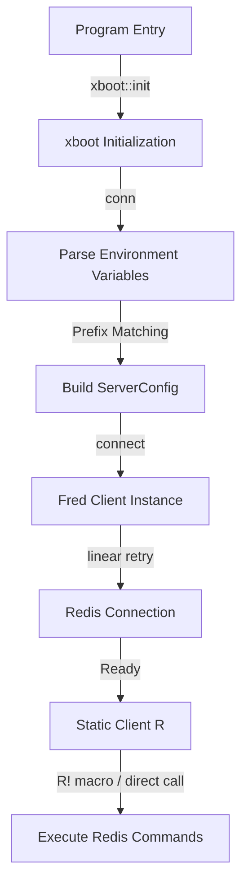

# xkv : Static Global Redis Client Manager for Fred and Kvrocks

- [Introduction](#introduction)
- [Usage](#usage)
- [Features](#features)
- [Design](#design)
- [Tech Stack](#tech-stack)
- [Directory Structure](#directory-structure)
- [API Description](#api-description)
- [History](#history)

## Introduction

xkv provides static global Redis client management. Built on top of Fred client, xkv enables connections to Redis or Kvrocks via environment variables.

## Usage

Refer to `tests/src/main.rs` for initialization and operations:

```rust
use aok::{OK, Result};
use xkv::xboot;
use xkv::{R, fred::interfaces::KeysInterface, log::info};

async fn test_redis() -> Result<()> {
  let key = "xkvtest1";
  let val = "abc";
  R!(del key);

  let v: bool = R.exists(key).await?;
  assert!(!v);

  let v: Option<String> = R.get(key).await?;
  info!("get {key} = {:?}", v);
  assert_eq!(v, None);

  R!(set key, val, None, None, false);

  let v: Option<String> = R.get(key).await?;
  info!("get {key} = {:?}", v);
  assert_eq!(v, Some(val.into()));

  R!(del key);

  OK
}

#[tokio::main]
async fn main() -> Result<()> {
  // Call it only once in the main function of the program
  xboot::init().await?;
  test_redis().await?;
  OK
}
```

Environment variables prefix configures connections:

```bash
R_NODE=127.0.0.1:6379
R_PASSWORD=your_password
```

## Features

- **Global Static Instance**: Connects static clients through macros, removing client-passing boilerplate.
- **Fred Integration**: Supports performance optimizations from Fred driver.
- **Multiple Topologies**: Configures centralized, clustered, sentinel, and Unix socket deployments.
- **Automatic Reconnection**: Implements linear backoff retry strategies.
- **Performance & Safety Optimizations**:
  - **Hot-loop Prevention**: Adds a 1-second non-blocking sleep delay during connection retries, preventing CPU-hogging hot loops when Redis is down.
  - **Zero-allocation env lookup**: Reuses an internal `String` buffer for environment variable assembly, avoiding memory allocation overhead from `format!`.
  - **Production-ready Validation**: Validates config inputs like `DB` and `SENTINEL_PORT` to prevent unexpected panics from bad configuration.

## Design

Initialization and query execution follow this logic:



## Tech Stack

- **Rust**: Language platform.
- **Fred**: Fast Redis client driver.
- **xboot**: Startup initialization framework.
- **aok**: Result error handler.

## Directory Structure

```text
.
├── Cargo.toml
├── README.md
├── README.mdt
├── src/
│   ├── lib.rs
│   ├── macro.rs
│   └── r.rs
└── tests/
    ├── Cargo.toml
    └── src/
        └── main.rs
```

## API Description

### Structs

#### `Server`

Defines static helpers returning `ServerConfig`.

- `pub fn unix_sock(path: impl Into<PathBuf>) -> ServerConfig`
  Creates Unix socket server configuration.
- `pub fn cluster(hosts: Vec<FredServer>) -> ServerConfig`
  Creates clustered deployment configuration.
- `pub fn sentinel(service_name: impl Into<String>, hosts: Vec<FredServer>, username: Option<String>, password: Option<String>) -> ServerConfig`
  Creates sentinel deployment configuration.
- `pub fn centralized(server: FredServer) -> ServerConfig`
  Creates centralized server configuration.

### Functions

- `pub fn server_li(host_port: impl AsRef<str>, default_port: u16) -> Vec<FredServer>`
  Parses space-separated lists of host-port addresses.
- `pub async fn conn(prefix: impl AsRef<str>) -> Result<Client>`
  Builds connection using environment variables matching prefix.
- `pub async fn connect(server: &ServerConfig, username: Option<String>, password: Option<String>, database: Option<u8>, resp: Option<&str>) -> Result<Client>`
  Initializes and connects client instances.

### Macros

- `conn!`
  Defines global static client.
- `conn_with_dollar!`
  Helper macro providing macro generation logic.

## History

In 2007, Salvatore Sanfilippo (known as antirez) faced performance bottlenecks while developing LLOOGG, real-time web analytics software. MySQL struggled with high-frequency writes and real-time retrieval of recent page views. To overcome limitations, Sanfilippo developed in-memory database designed around specific data structures like lists and sets. Released in 2009 under name Redis (Remote Dictionary Server), technology successfully powered LLOOGG and evolved into foundational modern caching infrastructure.
