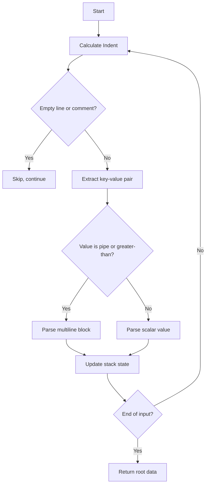
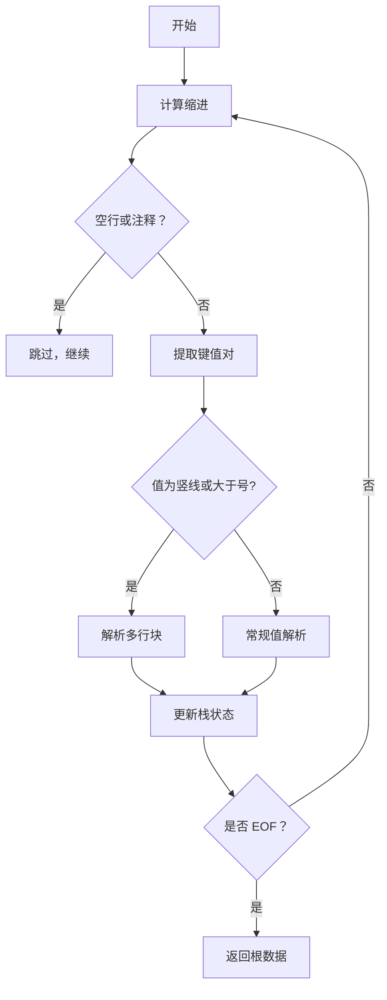

[English](#en) | [中文](#zh)

---

<a id="en"></a>

# @1-/yml : Minimalist High-Fault-Tolerant YAML Parser

- [@1-/yml : Minimalist High-Fault-Tolerant YAML Parser](#1-yml-minimalist-high-fault-tolerant-yaml-parser)
  - [Functionality](#functionality)
  - [Usage Demo](#usage-demo)
  - [Design Rationale](#design-rationale)
  - [Tech Stack](#tech-stack)
  - [Code Structure](#code-structure)
  - [Historical Note](#historical-note)
  - [About](#about)

## Functionality

Designed specifically for YAML generated by Large Language Models (LLMs). Conventional parsers fail on common LLM artifacts — irregular indentation, unclosed quotes, empty values, or inline comments. This parser employs a single-pass, stack-based state machine to achieve robust, one-scan parsing.

## Usage Demo

```bash
bun add @1-/yml
```

```javascript
import load from "@1-/yml/load.js";
import loads from "@1-/yml/loads.js";

// Parse YAML string
const obj = loads("a: 1\nb:\n  c: 2");

// Parse YAML file
const fileObj = load("./conf.yml");
```

## Design Rationale

Core logic is an indentation-driven stack state machine. Each line undergoes three phases:

1. Indent depth calculation
2. Key-value boundary detection (quotes, comments)
3. Dynamic stack update based on relative indent change



## Tech Stack

- Runtime: ES Module (Node.js ≥18 / Bun)
- Core dependency: `@3-/read` (file I/O)

## Code Structure

```
src/
├── loads.js     # Primary parser: string → JS object/array
└── load.js      # File wrapper: path → JS object/array
```

## Historical Note

YAML was co-designed in 2001 by Clark Evans, Ingy döt Net, and Oren Ben-Kiki as a _human-friendly data serialization language_. Its name — “YAML Ain’t Markup Language” — deliberately rejects markup semantics, prioritizing direct representation of native data structures (mappings, sequences, scalars). This parser honors that ethos: it avoids complex ASTs and backtracking, using only a lean state machine to recover semantic intent from imperfect input.

## About

This library is developed by [WebC.site](https://webc.site).

[WebC.site](https://webc.site): A new paradigm of web development for AI

---

<a id="zh"></a>

# @1-/yml : 极简高容错 YAML 解析器

- [@1-/yml : 极简高容错 YAML 解析器](#1-yml-极简高容错-yaml-解析器)
  - [功能介绍](#功能介绍)
  - [使用演示](#使用演示)
  - [设计思路](#设计思路)
  - [技术栈](#技术栈)
  - [代码结构](#代码结构)
  - [历史故事](#历史故事)
  - [关于](#关于)

## 功能介绍

专为大语言模型（LLM）生成的 YAML 设计。常规解析器因缩进不齐、引号未闭合、空值或注释干扰等常见瑕疵极易崩溃；本解析器采用单指针前向扫描状态机，一次遍历完成解析，具备强健的容错能力。

## 使用演示

```bash
bun add @1-/yml
```

```javascript
import load from "@1-/yml/load.js";
import loads from "@1-/yml/loads.js";

// 解析字符串
const obj = loads("a: 1\nb:\n  c: 2");

// 解析文件
const fileObj = load("./conf.yml");
```

## 设计思路

核心为基于栈的缩进驱动状态机。每行解析包含三阶段：

1. 计算当前缩进深度
2. 扫描键、值、引号与注释边界
3. 根据缩进变化动态维护嵌套栈



## 技术栈

- 运行时：ES Module（Node.js ≥18 / Bun）
- 核心依赖：`@3-/read`（文件读取）

## 代码结构

```
src/
├── loads.js     # 主解析器：字符串输入 → JS 对象/数组
└── load.js      # 文件封装：路径输入 → JS 对象/数组
```

## 历史故事

YAML 由 Clark Evans、Ingy döt Net 和 Oren Ben-Kiki 于 2001 年联合设计，初衷是成为“人类可读的数据序列化语言”。其名称 “YAML Ain’t Markup Language” 明确拒绝将自身定位为 XML 替代品，而是强调对原生数据结构（映射、序列、标量）的直接表达。本解析器延续这一精神，舍弃复杂语法树与多轮回溯，以极简状态机还原 YAML 的语义本质。

## 关于

本库由 [WebC.site](https://webc.site) 开发。

[WebC.site](https://webc.site) : 面向人工智能的网站开发新范式
