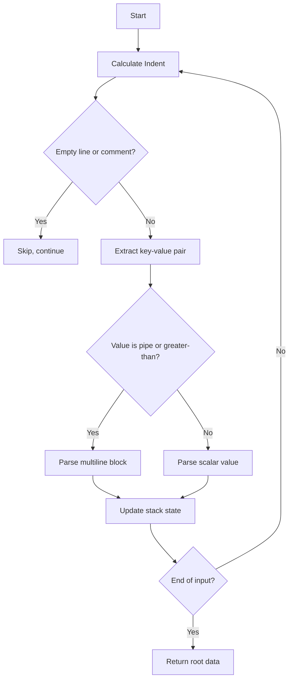

# @1-/yml : Minimalist High-Fault-Tolerant YAML Parser

## Functionality

Designed specifically for YAML generated by Large Language Models (LLMs). Conventional parsers fail on common LLM artifacts — irregular indentation, unclosed quotes, empty values, or inline comments. This parser employs a single-pass, stack-based state machine to achieve robust, one-scan parsing.

## Usage Demo

```bash
bun add @1-/yml
```

```javascript
import load from "@1-/yml/load.js";
import loads from "@1-/yml/loads.js";

// Parse YAML string
const obj = loads("a: 1\nb:\n  c: 2");

// Parse YAML file
const fileObj = load("./conf.yml");
```

## Design Rationale

Core logic is an indentation-driven stack state machine. Each line undergoes three phases:

1. Indent depth calculation
2. Key-value boundary detection (quotes, comments)
3. Dynamic stack update based on relative indent change



## Tech Stack

- Runtime: ES Module (Node.js ≥18 / Bun)
- Core dependency: `@3-/read` (file I/O)

## Code Structure

```
src/
├── loads.js     # Primary parser: string → JS object/array
└── load.js      # File wrapper: path → JS object/array
```

## Historical Note

YAML was co-designed in 2001 by Clark Evans, Ingy döt Net, and Oren Ben-Kiki as a _human-friendly data serialization language_. Its name — “YAML Ain’t Markup Language” — deliberately rejects markup semantics, prioritizing direct representation of native data structures (mappings, sequences, scalars). This parser honors that ethos: it avoids complex ASTs and backtracking, using only a lean state machine to recover semantic intent from imperfect input.
