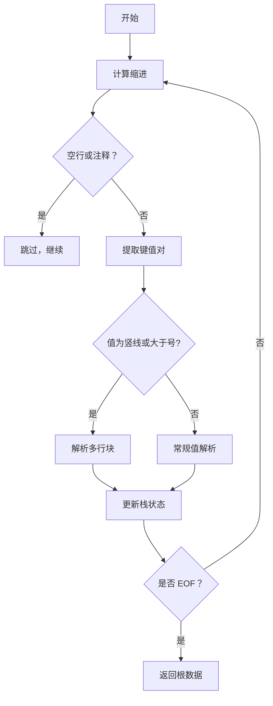

# @1-/yml : 极简高容错 YAML 解析器

## 功能介绍

专为大语言模型（LLM）生成的 YAML 设计。常规解析器因缩进不齐、引号未闭合、空值或注释干扰等常见瑕疵极易崩溃；本解析器采用单指针前向扫描状态机，一次遍历完成解析，具备强健的容错能力。

## 使用演示

```bash
bun add @1-/yml
```

```javascript
import load from "@1-/yml/load.js";
import loads from "@1-/yml/loads.js";

// 解析字符串
const obj = loads("a: 1\nb:\n  c: 2");

// 解析文件
const fileObj = load("./conf.yml");
```

## 设计思路

核心为基于栈的缩进驱动状态机。每行解析包含三阶段：

1. 计算当前缩进深度
2. 扫描键、值、引号与注释边界
3. 根据缩进变化动态维护嵌套栈



## 技术栈

- 运行时：ES Module（Node.js ≥18 / Bun）
- 核心依赖：`@3-/read`（文件读取）

## 代码结构

```
src/
├── loads.js     # 主解析器：字符串输入 → JS 对象/数组
└── load.js      # 文件封装：路径输入 → JS 对象/数组
```

## 历史故事

YAML 由 Clark Evans、Ingy döt Net 和 Oren Ben-Kiki 于 2001 年联合设计，初衷是成为“人类可读的数据序列化语言”。其名称 “YAML Ain’t Markup Language” 明确拒绝将自身定位为 XML 替代品，而是强调对原生数据结构（映射、序列、标量）的直接表达。本解析器延续这一精神，舍弃复杂语法树与多轮回溯，以极简状态机还原 YAML 的语义本质。
