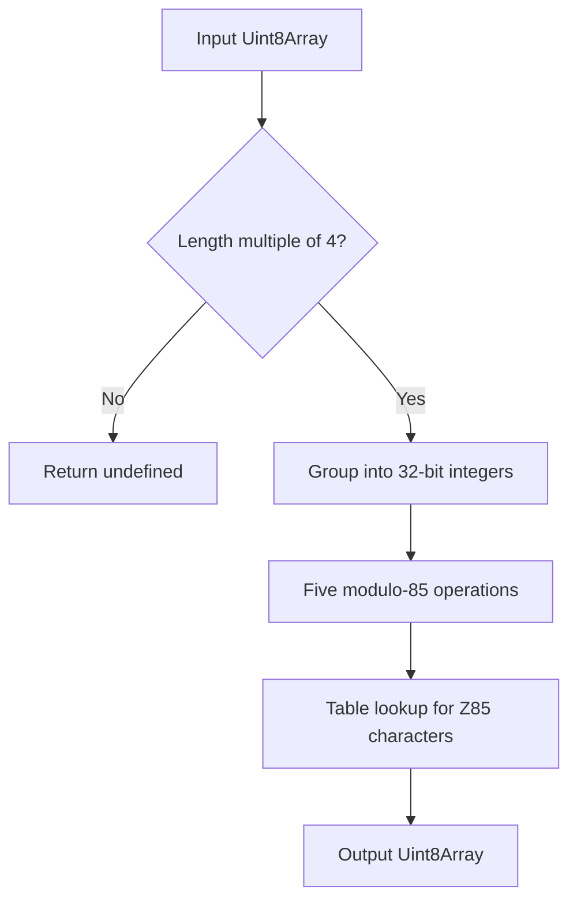
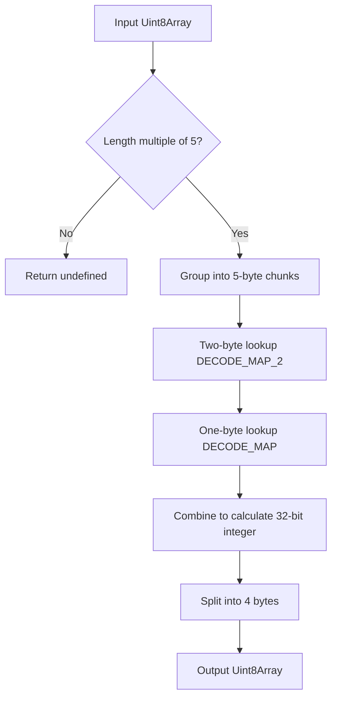
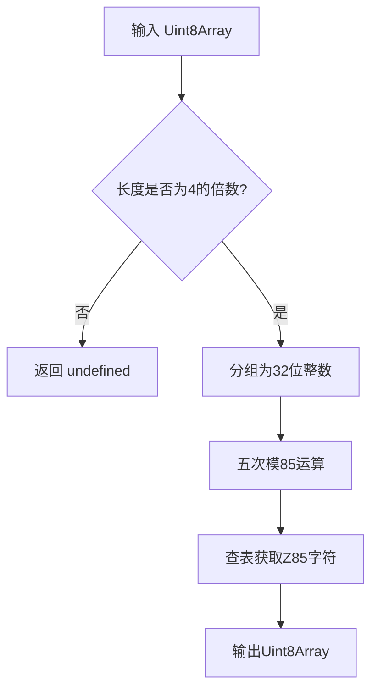
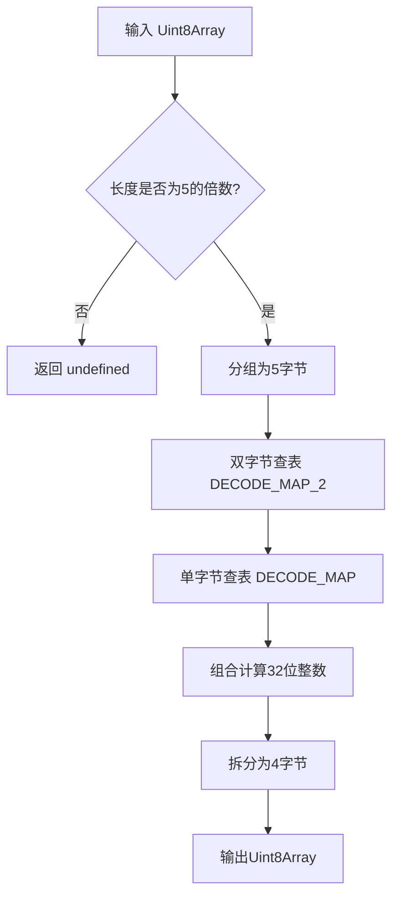

[English](#en) | [中文](#zh)

---

<a id="en"></a>
# @1-/z85 : Ultra-Fast and Minimal Z85 Encoding and Decoding Implementation

- [@1-/z85 : Ultra-Fast and Minimal Z85 Encoding and Decoding Implementation](#1-z85-ultra-fast-and-minimal-z85-encoding-and-decoding-implementation)
  - [Functionality](#functionality)
  - [Usage](#usage)
    - [Install](#install)
    - [Encoding](#encoding)
    - [Decoding](#decoding)
  - [Design Rationale](#design-rationale)
  - [Technology Stack](#technology-stack)
  - [Code Structure](#code-structure)
  - [Historical Context](#historical-context)
  - [About](#about)

## Functionality

Provides Z85 encoding and decoding compliant with ZeroMQ RFC 32. Solves the problem of excessive bundle size and suboptimal performance in general-purpose Base85 libraries for browsers and lightweight runtimes, achieving industry-leading metrics through algorithmic optimization and zero-dependency design.

## Usage

### Install

```bash
npm install @1-/z85
```

### Encoding

Encodes a `Uint8Array` to a Z85-encoded `Uint8Array`. The input length must be a multiple of 4.

```javascript
import z85e from "@1-/z85/src/z85e.js";

const data = new Uint8Array([1, 2, 3, 4]);
const encoded = z85e(data);
// Returns Uint8Array(5) [ 48, 48, 48, 48, 103 ] (represents string "0000g")
```

### Decoding

Decodes a Z85-encoded `Uint8Array` back to a `Uint8Array`. The input length must be a multiple of 5.

```javascript
import z85d from "@1-/z85/src/z85d.js";

const decoded = z85d(encoded);
// Returns Uint8Array(4) [ 1, 2, 3, 4 ]
```

## Design Rationale

The library uses a hybrid table-lookup and bit-manipulation approach, refactored with low-coupling and high-cohesion principles to extract and reuse common assets:

- **Common Module** (`_.js`): Defines the standard Z85 character set and converts it to UTF-8 encoded bytes, shared by both the encoder and decoder.
- **Encoder** (`z85e.js`): Imports the character mapping table from the common module, performing five modulo-85 operations and table-lookups per 32-bit unsigned integer, utilizing `>>> 0` and `| 0` for bitwise operations and truncation.
- **Decoder** (`z85d.js`): Imports the character set from the common module. Precomputes dual-layer lookup tables upon module load: a first-tier `DECODE_MAP` (256-byte `Int8Array`) for fast single-byte validation, and a second-tier `DECODE_MAP_2` (65536-byte `Int16Array`) mapping all double-byte combinations (85×85=7225) to their values. This decomposes 5-byte decoding into three lookups and two multiply-add operations.





## Technology Stack

- Runtime: Standard ECMAScript 2022 (ES13)
- External Dependency: None

## Code Structure

```
src/
├── _.js        # Z85 Shared character set table (UTF-8 encoded)
├── z85e.js     # Primary Z85 encoder logic
└── z85d.js     # Primary Z85 decoder logic
```

## Historical Context

Z85 encoding was designed by Pieter Hintjens in 2011 for the ZeroMQ protocol as a replacement for Base64 and Ascii85. Its key innovation is the selection of 85 printable ASCII characters (0–9, a–z, A–Z, .-:+=^!/*?&<>()[]{}@%$#), reducing encoded data size by ~12% compared to Base64 while completely avoiding the parsing ambiguity introduced by the `z` character in Ascii85. RFC 32 formally standardized it, establishing Z85 as the de facto standard for textual binary data transport within the ZeroMQ ecosystem.

## About

This library is developed by [WebC.site](https://webc.site).

[WebC.site](https://webc.site): A new paradigm of web development for AI


---

<a id="zh"></a>
# @1-/z85 : 极速、超轻量、零依赖的 Z85 编解码实现

- [@1-/z85 : 极速、超轻量、零依赖的 Z85 编解码实现](#1-z85-极速超轻量零依赖的-z85-编解码实现)
  - [功能介绍](#功能介绍)
  - [使用演示](#使用演示)
    - [安装](#安装)
    - [编码](#编码)
    - [解码](#解码)
  - [设计思路](#设计思路)
  - [技术栈](#技术栈)
  - [代码结构](#代码结构)
  - [历史故事](#历史故事)
  - [关于](#关于)

## 功能介绍

提供符合 ZeroMQ RFC 32 规范的 Z85 编码与解码功能。解决通用 Base85 库在浏览器与轻量级运行时中体积过大、性能不足的问题，通过算法优化与零依赖设计，达成业界领先的体积与吞吐量指标。

## 使用演示

### 安装

```bash
npm install @1-/z85
```

### 编码

将 `Uint8Array` 编码为 Z85 格式的 `Uint8Array`。输入长度必须是 4 的倍数。

```javascript
import z85e from "@1-/z85/src/z85e.js";

const data = new Uint8Array([1, 2, 3, 4]);
const encoded = z85e(data);
// 返回 Uint8Array(5) [ 48, 48, 48, 48, 103 ] (代表字符串 "0000g")
```

### 解码

将 Z85 格式的 `Uint8Array` 解码为原始的 `Uint8Array`。输入长度必须是 5 的倍数。

```javascript
import z85d from "@1-/z85/src/z85d.js";

const decoded = z85d(encoded);
// 返回 Uint8Array(4) [ 1, 2, 3, 4 ]
```

## 设计思路

本库采用查表法与位运算结合的设计，以低耦合、高内聚为原则进行重构，将公共字符集与工具提取复用：

- **公共模块**（`_.js`）：定义 Z85 标准字符集，并使用 UTF-8 编码转换为字节数组，供编码器和解码器共享。
- **编码器**（`z85e.js`）：从公共模块导入字符映射表，对每个 32 位无符号整数进行五次模除与查表操作，辅以 `>>> 0` 与 `| 0` 进行位运算及截断。
- **解码器**（`z85d.js`）：从公共模块导入字符集。在模块加载时预计算双层查表：第一层 `DECODE_MAP`（256 字节 `Int8Array`）用于快速单字节合法性校验；第二层 `DECODE_MAP_2`（65536 字节 `Int16Array`）预计算所有双字节组合的值（85×85=7225）。将五字节解码操作简化为三次查表与两次乘加运算。





## 技术栈

- 运行时：标准 ECMAScript 2022（ES13）
- 外部依赖：无

## 代码结构

```
src/
├── _.js        # Z85 共享字符集表（UTF-8 编码）
├── z85e.js     # Z85 编码器主逻辑
└── z85d.js     # Z85 解码器主逻辑
```

## 历史故事

Z85 编码由 Pieter Hintjens 于 2011 年为 ZeroMQ 协议设计，旨在替代 Base64 和 Ascii85。其核心创新在于选用 85 个可打印 ASCII 字符（0–9, a–z, A–Z, .-:+=^!/*?&<>()[]{}@%$#），使编码后数据体积比 Base64 减少约 12%，且完全规避了 Ascii85 中因 `z` 字符导致的解析歧义问题。RFC 32 将其正式标准化，成为 ZeroMQ 生态中二进制数据文本化传输的事实标准。

## 关于

本库由 [WebC.site](https://webc.site) 开发。

[WebC.site](https://webc.site) : 面向人工智能的网站开发新范式

