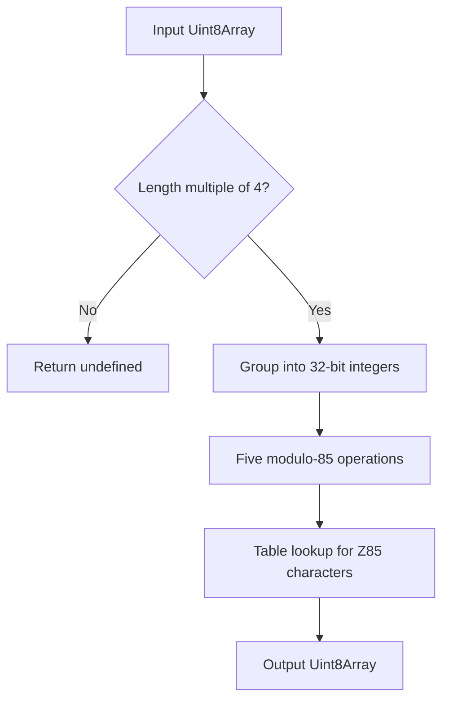
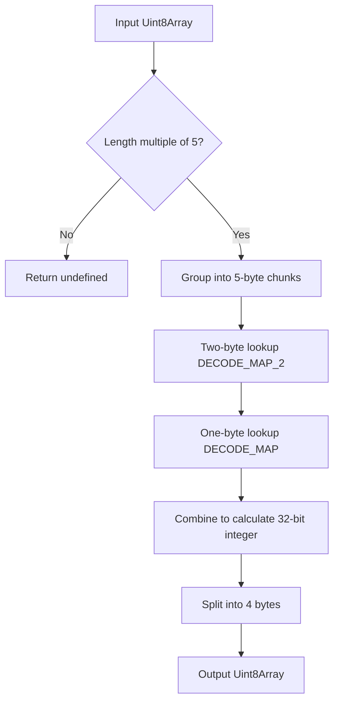

# @1-/z85 : Ultra-Fast and Minimal Z85 Encoding and Decoding Implementation

## Functionality

Provides Z85 encoding and decoding compliant with ZeroMQ RFC 32. Solves the problem of excessive bundle size and suboptimal performance in general-purpose Base85 libraries for browsers and lightweight runtimes, achieving industry-leading metrics through algorithmic optimization and zero-dependency design.

## Usage

### Install

```bash
npm install @1-/z85
```

### Encoding

Encodes a `Uint8Array` to a Z85-encoded `Uint8Array`. The input length must be a multiple of 4.

```javascript
import z85e from "@1-/z85/src/z85e.js";

const data = new Uint8Array([1, 2, 3, 4]);
const encoded = z85e(data);
// Returns Uint8Array(5) [ 48, 48, 48, 48, 103 ] (represents string "0000g")
```

### Decoding

Decodes a Z85-encoded `Uint8Array` back to a `Uint8Array`. The input length must be a multiple of 5.

```javascript
import z85d from "@1-/z85/src/z85d.js";

const decoded = z85d(encoded);
// Returns Uint8Array(4) [ 1, 2, 3, 4 ]
```

## Design Rationale

The library uses a hybrid table-lookup and bit-manipulation approach, refactored with low-coupling and high-cohesion principles to extract and reuse common assets:

- **Common Module** (`_.js`): Defines the standard Z85 character set and converts it to UTF-8 encoded bytes, shared by both the encoder and decoder.
- **Encoder** (`z85e.js`): Imports the character mapping table from the common module, performing five modulo-85 operations and table-lookups per 32-bit unsigned integer, utilizing `>>> 0` and `| 0` for bitwise operations and truncation.
- **Decoder** (`z85d.js`): Imports the character set from the common module. Precomputes dual-layer lookup tables upon module load: a first-tier `DECODE_MAP` (256-byte `Int8Array`) for fast single-byte validation, and a second-tier `DECODE_MAP_2` (65536-byte `Int16Array`) mapping all double-byte combinations (85×85=7225) to their values. This decomposes 5-byte decoding into three lookups and two multiply-add operations.





## Technology Stack

- Runtime: Standard ECMAScript 2022 (ES13)
- External Dependency: None

## Code Structure

```
src/
├── _.js        # Z85 Shared character set table (UTF-8 encoded)
├── z85e.js     # Primary Z85 encoder logic
└── z85d.js     # Primary Z85 decoder logic
```

## Historical Context

Z85 encoding was designed by Pieter Hintjens in 2011 for the ZeroMQ protocol as a replacement for Base64 and Ascii85. Its key innovation is the selection of 85 printable ASCII characters (0–9, a–z, A–Z, .-:+=^!/\*?&<>()[]{}@%$#), reducing encoded data size by ~12% compared to Base64 while completely avoiding the parsing ambiguity introduced by the `z` character in Ascii85. RFC 32 formally standardized it, establishing Z85 as the de facto standard for textual binary data transport within the ZeroMQ ecosystem.
