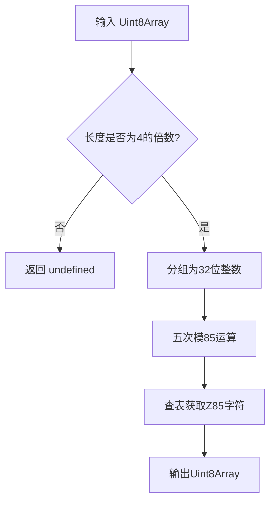
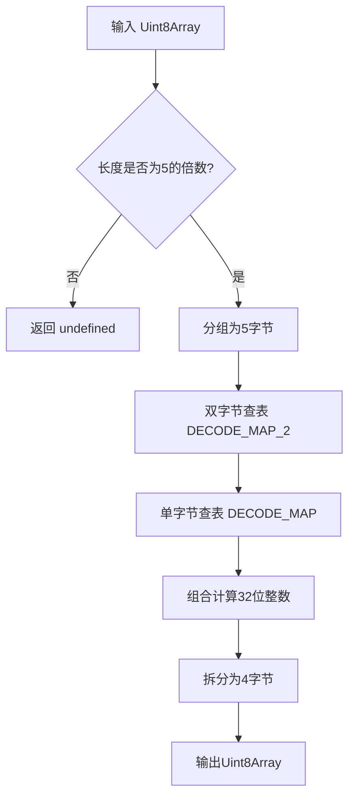

# @1-/z85 : 极速、超轻量、零依赖的 Z85 编解码实现

## 功能介绍

提供符合 ZeroMQ RFC 32 规范的 Z85 编码与解码功能。解决通用 Base85 库在浏览器与轻量级运行时中体积过大、性能不足的问题，通过算法优化与零依赖设计，达成业界领先的体积与吞吐量指标。

## 使用演示

### 安装

```bash
npm install @1-/z85
```

### 编码

将 `Uint8Array` 编码为 Z85 格式的 `Uint8Array`。输入长度必须是 4 的倍数。

```javascript
import z85e from "@1-/z85/src/z85e.js";

const data = new Uint8Array([1, 2, 3, 4]);
const encoded = z85e(data);
// 返回 Uint8Array(5) [ 48, 48, 48, 48, 103 ] (代表字符串 "0000g")
```

### 解码

将 Z85 格式的 `Uint8Array` 解码为原始的 `Uint8Array`。输入长度必须是 5 的倍数。

```javascript
import z85d from "@1-/z85/src/z85d.js";

const decoded = z85d(encoded);
// 返回 Uint8Array(4) [ 1, 2, 3, 4 ]
```

## 设计思路

本库采用查表法与位运算结合的设计，以低耦合、高内聚为原则进行重构，将公共字符集与工具提取复用：

- **公共模块**（`_.js`）：定义 Z85 标准字符集，并使用 UTF-8 编码转换为字节数组，供编码器和解码器共享。
- **编码器**（`z85e.js`）：从公共模块导入字符映射表，对每个 32 位无符号整数进行五次模除与查表操作，辅以 `>>> 0` 与 `| 0` 进行位运算及截断。
- **解码器**（`z85d.js`）：从公共模块导入字符集。在模块加载时预计算双层查表：第一层 `DECODE_MAP`（256 字节 `Int8Array`）用于快速单字节合法性校验；第二层 `DECODE_MAP_2`（65536 字节 `Int16Array`）预计算所有双字节组合的值（85×85=7225）。将五字节解码操作简化为三次查表与两次乘加运算。





## 技术栈

- 运行时：标准 ECMAScript 2022（ES13）
- 外部依赖：无

## 代码结构

```
src/
├── _.js        # Z85 共享字符集表（UTF-8 编码）
├── z85e.js     # Z85 编码器主逻辑
└── z85d.js     # Z85 解码器主逻辑
```

## 历史故事

Z85 编码由 Pieter Hintjens 于 2011 年为 ZeroMQ 协议设计，旨在替代 Base64 和 Ascii85。其核心创新在于选用 85 个可打印 ASCII 字符（0–9, a–z, A–Z, .-:+=^!/\*?&<>()[]{}@%$#），使编码后数据体积比 Base64 减少约 12%，且完全规避了 Ascii85 中因 `z` 字符导致的解析歧义问题。RFC 32 将其正式标准化，成为 ZeroMQ 生态中二进制数据文本化传输的事实标准。
